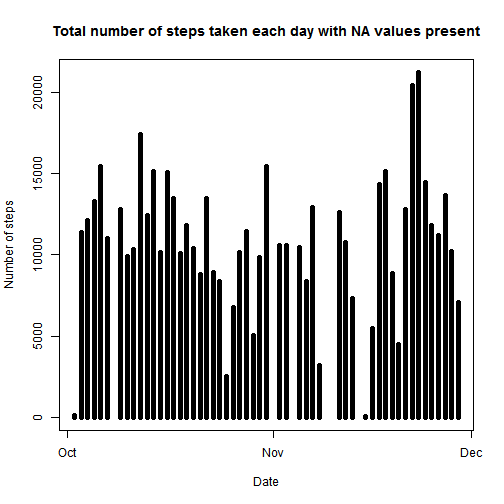

#Data Science Specialism

###Module 5 - Reproducible research (May 2015)

###DATA ANALYST: Fiona

###Date: 2015 May 13

##Project One - Investigating the number of steps taken as recorded by a personal activity monitoring device during October and November 2012.

###How the data was collected?

The device collected data at 5 minute intervals through out the day. The data consists of two months of data from an anonymous individual collected during the months of October and November 2012 and include the number of steps taken in 5 minute intervals for every day of the two months.


###R SCRIPT


```r
##1 - Preprocessing of the raw data into analytical data - three steps

	##1.1 - loading libraries
	library(data.table)
	library(dplyr)
	library(reshape2)
	library(ggplot2)
	library(knitr)
	library(rmarkdown)

	##NOTE - for knitr/rmarkdown to work in RCONSOLE you are required to download the PANDOC package available online at: http://pandoc.org/installing.html

		##1.2 - loading the dataset
		dataset <- read.table("activity.csv", header = TRUE, sep = ",")

			##1.3 - converting the date in the date readable format yyyy-mm-dd
			dataset$date <- strptime(dataset$date, format = "%Y-%m-%d")

				##1.4 changing interval from int to numeric then to four characters
				dataset$interval <- as.numeric(dataset$interval)
				dataset$interval <- sprintf("%04d", dataset$interval)	
```

##QUESTION 1 - What is mean total number of steps taken per day?

	ADDITIONAL INSTRUCTIONS - "for this part of the assignment, you can IGNORE the missing values in the dataset".


```r
	##1 - additional data processing - removing the NA values
		
		##1.1 - removing na values
		nasubset <- na.omit(dataset)

			##1.2 - removing interval column
			nasubset <- nasubset[c(1:2)]
				
				##1.3 - calculating total number of steps taken every day by melting/dcast (reshape2 package)
				meltedsubset <- melt(nasubset, id.vars = "date")
				totalsteps <- dcast(meltedsubset, date ~ variable, sum)
```

```
## Warning in is.na(secs): is.na() applied to non-(list or vector) of type
## 'NULL'
```

```
## Warning in is.na(secs): is.na() applied to non-(list or vector) of type
## 'NULL'
```

###PART 1 (Q1) - Plot a histogram - total number of steps taken each day.


```r
	##1 - plotting the histogram
	with (totalsteps, {
	plot(date, steps, main = "Total number of steps taken each day with NA values present", type = "h", xlab = "Date", ylab = "Number of steps", lwd = 5)
	})
```

 

###PART 2 (Q1) - Calculate and report the mean and median of the total number of steps taken per day.


```r
	##1 - mean value calculation
	mean(totalsteps$steps)
```

```
## [1] 10766.19
```

```r
		##2 - median value calculation
		median(totalsteps$steps)
```

```
## [1] 10765
```

###QUESTION 2 -	What is the average daily activity pattern?


```r
	##2 - additional processing of dataset
	
		##2.1 - starting new dataset for the analysis
		patterndataset <- dataset
	
			##2.2 - removing na values
			napattern <- na.omit(patterndataset)
			
				##2.3 - removing the date column
				napattern <- napattern[c(3, 1)]
				
					##2.4 - calculating the mean total number of steps per interval
					meltedpattern <- melt(napattern, id.vars = "interval")
					totalinterval <- dcast(meltedpattern, interval ~ variable, mean)
```

###PART 1 (Q2) - Make a time series plot (i.e. type = "l") of the 5-minute interval (x-axis) and the average number of steps taken, averaged across all days (y-axis)


```r
	##2.1 - plotting the graph
	with (totalinterval, {
	plot(interval, steps, main = "Mean number of steps taken in each 5 minute interval \n", type = "l", xlab = "Time (hhmm)", ylab = "Mean number of steps")
	})
```

 

###PART 2 (Q2) - Which 5-minute interval, on average across all the days in the dataset, contains the maximum number of steps?


```r
	##2.2.1 - finding the maximum number of steps
	interval <- sort(totalinterval$steps, decreasing = TRUE)

		##2.2.2 - locating the row number for "interval"
		rownumber <- match(interval, totalinterval$steps)

			##2.2.3 - output - the 5-minute interval
			head(totalinterval[rownumber,],1)
```

```
##     interval    steps
## 104     0835 206.1698
```

###QUESTION 3 - Calculate and report the total number of missing values in the dataset (i.e. the total number of rows with N.A.s)


```r
	##additional data processing
	
	##3.1 - starting with a fresh dataset for the analysis
	valuesna <- read.table("activity.csv", header = TRUE, sep = ",")

		##3.2 changing interval from int to numeric then to four characters
		valuesna$interval <- as.numeric(valuesna$interval)
		valuesna$interval <- sprintf("%04d", valuesna$interval)	
```

Number of rows with missing values (as NA)?	
	

```r
	##3.3 - calculating the number of rows with NA values
	countnasubset <- sum(complete.cases(valuesna))
	countnasubset
```

```
## [1] 15264
```

###PART 1 (Q3) - Devise a STRATEGY for filling in all of the missing values in the dataset. The strategy does not need to be sophisticated. For example, you could use the mean/median for that day, or the mean for that 5-minute interval, etc.

###MY STRATEGY: For this part of the data processing I am replacing the NA values in each interval period with the mean value for that particular interval, and those values are shown below.  Then I created code to build a new column called "steps" and fill it will the exact step values or replacements for the NA values.


```r
	##3.1.1 - starting with a fresh dataset for the calculated mean totals for each interval period. And the values are:
	intervalreplacements <- totalinterval
	intervalreplacements
```

```
##     interval       steps
## 1       0000   1.7169811
## 2       0005   0.3396226
## 3       0010   0.1320755
## 4       0015   0.1509434
## 5       0020   0.0754717
## 6       0025   2.0943396
## 7       0030   0.5283019
## 8       0035   0.8679245
## 9       0040   0.0000000
## 10      0045   1.4716981
## 11      0050   0.3018868
## 12      0055   0.1320755
## 13      0100   0.3207547
## 14      0105   0.6792453
## 15      0110   0.1509434
## 16      0115   0.3396226
## 17      0120   0.0000000
## 18      0125   1.1132075
## 19      0130   1.8301887
## 20      0135   0.1698113
## 21      0140   0.1698113
## 22      0145   0.3773585
## 23      0150   0.2641509
## 24      0155   0.0000000
## 25      0200   0.0000000
## 26      0205   0.0000000
## 27      0210   1.1320755
## 28      0215   0.0000000
## 29      0220   0.0000000
## 30      0225   0.1320755
## 31      0230   0.0000000
## 32      0235   0.2264151
## 33      0240   0.0000000
## 34      0245   0.0000000
## 35      0250   1.5471698
## 36      0255   0.9433962
## 37      0300   0.0000000
## 38      0305   0.0000000
## 39      0310   0.0000000
## 40      0315   0.0000000
## 41      0320   0.2075472
## 42      0325   0.6226415
## 43      0330   1.6226415
## 44      0335   0.5849057
## 45      0340   0.4905660
## 46      0345   0.0754717
## 47      0350   0.0000000
## 48      0355   0.0000000
## 49      0400   1.1886792
## 50      0405   0.9433962
## 51      0410   2.5660377
## 52      0415   0.0000000
## 53      0420   0.3396226
## 54      0425   0.3584906
## 55      0430   4.1132075
## 56      0435   0.6603774
## 57      0440   3.4905660
## 58      0445   0.8301887
## 59      0450   3.1132075
## 60      0455   1.1132075
## 61      0500   0.0000000
## 62      0505   1.5660377
## 63      0510   3.0000000
## 64      0515   2.2452830
## 65      0520   3.3207547
## 66      0525   2.9622642
## 67      0530   2.0943396
## 68      0535   6.0566038
## 69      0540  16.0188679
## 70      0545  18.3396226
## 71      0550  39.4528302
## 72      0555  44.4905660
## 73      0600  31.4905660
## 74      0605  49.2641509
## 75      0610  53.7735849
## 76      0615  63.4528302
## 77      0620  49.9622642
## 78      0625  47.0754717
## 79      0630  52.1509434
## 80      0635  39.3396226
## 81      0640  44.0188679
## 82      0645  44.1698113
## 83      0650  37.3584906
## 84      0655  49.0377358
## 85      0700  43.8113208
## 86      0705  44.3773585
## 87      0710  50.5094340
## 88      0715  54.5094340
## 89      0720  49.9245283
## 90      0725  50.9811321
## 91      0730  55.6792453
## 92      0735  44.3207547
## 93      0740  52.2641509
## 94      0745  69.5471698
## 95      0750  57.8490566
## 96      0755  56.1509434
## 97      0800  73.3773585
## 98      0805  68.2075472
## 99      0810 129.4339623
## 100     0815 157.5283019
## 101     0820 171.1509434
## 102     0825 155.3962264
## 103     0830 177.3018868
## 104     0835 206.1698113
## 105     0840 195.9245283
## 106     0845 179.5660377
## 107     0850 183.3962264
## 108     0855 167.0188679
## 109     0900 143.4528302
## 110     0905 124.0377358
## 111     0910 109.1132075
## 112     0915 108.1132075
## 113     0920 103.7169811
## 114     0925  95.9622642
## 115     0930  66.2075472
## 116     0935  45.2264151
## 117     0940  24.7924528
## 118     0945  38.7547170
## 119     0950  34.9811321
## 120     0955  21.0566038
## 121     1000  40.5660377
## 122     1005  26.9811321
## 123     1010  42.4150943
## 124     1015  52.6603774
## 125     1020  38.9245283
## 126     1025  50.7924528
## 127     1030  44.2830189
## 128     1035  37.4150943
## 129     1040  34.6981132
## 130     1045  28.3396226
## 131     1050  25.0943396
## 132     1055  31.9433962
## 133     1100  31.3584906
## 134     1105  29.6792453
## 135     1110  21.3207547
## 136     1115  25.5471698
## 137     1120  28.3773585
## 138     1125  26.4716981
## 139     1130  33.4339623
## 140     1135  49.9811321
## 141     1140  42.0377358
## 142     1145  44.6037736
## 143     1150  46.0377358
## 144     1155  59.1886792
## 145     1200  63.8679245
## 146     1205  87.6981132
## 147     1210  94.8490566
## 148     1215  92.7735849
## 149     1220  63.3962264
## 150     1225  50.1698113
## 151     1230  54.4716981
## 152     1235  32.4150943
## 153     1240  26.5283019
## 154     1245  37.7358491
## 155     1250  45.0566038
## 156     1255  67.2830189
## 157     1300  42.3396226
## 158     1305  39.8867925
## 159     1310  43.2641509
## 160     1315  40.9811321
## 161     1320  46.2452830
## 162     1325  56.4339623
## 163     1330  42.7547170
## 164     1335  25.1320755
## 165     1340  39.9622642
## 166     1345  53.5471698
## 167     1350  47.3207547
## 168     1355  60.8113208
## 169     1400  55.7547170
## 170     1405  51.9622642
## 171     1410  43.5849057
## 172     1415  48.6981132
## 173     1420  35.4716981
## 174     1425  37.5471698
## 175     1430  41.8490566
## 176     1435  27.5094340
## 177     1440  17.1132075
## 178     1445  26.0754717
## 179     1450  43.6226415
## 180     1455  43.7735849
## 181     1500  30.0188679
## 182     1505  36.0754717
## 183     1510  35.4905660
## 184     1515  38.8490566
## 185     1520  45.9622642
## 186     1525  47.7547170
## 187     1530  48.1320755
## 188     1535  65.3207547
## 189     1540  82.9056604
## 190     1545  98.6603774
## 191     1550 102.1132075
## 192     1555  83.9622642
## 193     1600  62.1320755
## 194     1605  64.1320755
## 195     1610  74.5471698
## 196     1615  63.1698113
## 197     1620  56.9056604
## 198     1625  59.7735849
## 199     1630  43.8679245
## 200     1635  38.5660377
## 201     1640  44.6603774
## 202     1645  45.4528302
## 203     1650  46.2075472
## 204     1655  43.6792453
## 205     1700  46.6226415
## 206     1705  56.3018868
## 207     1710  50.7169811
## 208     1715  61.2264151
## 209     1720  72.7169811
## 210     1725  78.9433962
## 211     1730  68.9433962
## 212     1735  59.6603774
## 213     1740  75.0943396
## 214     1745  56.5094340
## 215     1750  34.7735849
## 216     1755  37.4528302
## 217     1800  40.6792453
## 218     1805  58.0188679
## 219     1810  74.6981132
## 220     1815  85.3207547
## 221     1820  59.2641509
## 222     1825  67.7735849
## 223     1830  77.6981132
## 224     1835  74.2452830
## 225     1840  85.3396226
## 226     1845  99.4528302
## 227     1850  86.5849057
## 228     1855  85.6037736
## 229     1900  84.8679245
## 230     1905  77.8301887
## 231     1910  58.0377358
## 232     1915  53.3584906
## 233     1920  36.3207547
## 234     1925  20.7169811
## 235     1930  27.3962264
## 236     1935  40.0188679
## 237     1940  30.2075472
## 238     1945  25.5471698
## 239     1950  45.6603774
## 240     1955  33.5283019
## 241     2000  19.6226415
## 242     2005  19.0188679
## 243     2010  19.3396226
## 244     2015  33.3396226
## 245     2020  26.8113208
## 246     2025  21.1698113
## 247     2030  27.3018868
## 248     2035  21.3396226
## 249     2040  19.5471698
## 250     2045  21.3207547
## 251     2050  32.3018868
## 252     2055  20.1509434
## 253     2100  15.9433962
## 254     2105  17.2264151
## 255     2110  23.4528302
## 256     2115  19.2452830
## 257     2120  12.4528302
## 258     2125   8.0188679
## 259     2130  14.6603774
## 260     2135  16.3018868
## 261     2140   8.6792453
## 262     2145   7.7924528
## 263     2150   8.1320755
## 264     2155   2.6226415
## 265     2200   1.4528302
## 266     2205   3.6792453
## 267     2210   4.8113208
## 268     2215   8.5094340
## 269     2220   7.0754717
## 270     2225   8.6981132
## 271     2230   9.7547170
## 272     2235   2.2075472
## 273     2240   0.3207547
## 274     2245   0.1132075
## 275     2250   1.6037736
## 276     2255   4.6037736
## 277     2300   3.3018868
## 278     2305   2.8490566
## 279     2310   0.0000000
## 280     2315   0.8301887
## 281     2320   0.9622642
## 282     2325   1.5849057
## 283     2330   2.6037736
## 284     2335   4.6981132
## 285     2340   3.3018868
## 286     2345   0.6415094
## 287     2350   0.2264151
## 288     2355   1.0754717
```
	
###PART 2 (Q3) - Create a new dataset that is equal to the original dataset but with the missing data filled in.


```r
	##calculating a new column with number of steps - actual values or replacement values for NAs

	##3.2.1 - merging the two dataset by interval values
	mergena <- merge(valuesna, intervalreplacements, by = "interval")
		
			##3.2.2 - creating the new column
			mergena$steps <- 0
	
				##3.2.3 - the calculation
				rownumber = seq(1, 17568)
				for (i in rownumber) {	
					if (is.na(mergena$steps.x[i])) {
						mergena$steps[i] <- mergena$steps.y[i]
							} else {
								mergena$steps[i] <- mergena$steps.x[i]
					}
				}
	
					##3.2.4 - removing the unwanted columns so this dataset matches the original dataset
					finalsubset <- mergena[c(5,3,1)]	

	##3.2.5 - displaying the first and last rows from original (dataset) and non NA (finalsubset) showing that the NAs have been removed
	head(dataset, 1)
```

```
##   steps       date interval
## 1    NA 2012-10-01     0000
```

```r
	head(finalsubset, 1)
```

```
##      steps       date interval
## 1 1.716981 2012-10-01     0000
```

```r
	tail(dataset, 1)
```

```
##       steps       date interval
## 17568    NA 2012-11-30     2355
```

```r
	tail(finalsubset, 1)
```

```
##          steps       date interval
## 17568 1.075472 2012-11-30     2355
```

###PART 3 (Q3) - Make a histogram of the total number of steps taken each day.  Calculate and report the mean and median total number of steps taken per day.  Do these values differ from the estimates from the first part of the assignment?  What is the impact of imputing missing data on the estimates of the total daily number of steps?


```r
	##additional processing of dataset
	
	##3.3.1 - removing the interval column
	finalsubset <- finalsubset[c(1:2)]

		##3.3.2 - converting the date in the date readable format yyyy-mm-dd
		finalsubset$date <- strptime(finalsubset$date, format = "%Y-%m-%d")
			
			##3.3.3 - calculating the mean total number of steps per interval
			meltedpattern <- melt(finalsubset, id.vars = "date")
			finalna <- dcast(meltedpattern, date ~ variable, sum)
```

```
## Warning in is.na(secs): is.na() applied to non-(list or vector) of type
## 'NULL'
```

```
## Warning in is.na(secs): is.na() applied to non-(list or vector) of type
## 'NULL'
```

```r
	##3.3.4 - plotting the graph
	with (finalna, {
	plot(date, steps, main = "Total number of steps taken each day with NA values replaced", type = "h", xlab = "Date", ylab = "Number of steps", lwd = 5)
	})
```

 

```r
	##calculating mean and median values

	##3.3.5 - mean value calculation
	mean(finalna$steps)
```

```
## [1] 10766.19
```

```r
		##3.3.6 - median value calculation
		median(finalna$steps)
```

```
## [1] 10766.19
```
		
	##how do values differ with NA and without NA values?
	
	The median value for the replaced missing values dataset  has increased and shifted to the mean value as shown in the table below.


```r
	##3.3.7 - creating a mini data table of the mean and median results for comparison
	comparison <- matrix(1:2, 2,3)
	meanvalue1 <- mean(totalsteps$steps)
	medianvalue1 <- median(totalsteps$steps)	
	meanvalue2 <- mean(finalna$steps)
	medianvalue2 <- median(finalna$steps)
	values1 <- cbind("with NA", meanvalue1, medianvalue1)
	values2 <- cbind("replaced NA", meanvalue2, medianvalue2)
	comparison <- rbind(values1, values2)
	colnames(comparison) <- c("analysis?", "mean value", "median value")
	comparison
```

```
##      analysis?     mean value         median value      
## [1,] "with NA"     "10766.1886792453" "10765"           
## [2,] "replaced NA" "10766.1886792453" "10766.1886792453"
```
	
	##What is impact of replacing NA with mean interval value?

	Days where values were unavailable now have values filled with mean value of replacement interval values.  This analysis makes the assumption that the device did not correctly record steps for that particular interval - is this possible?  I suggest that the device did not plot the steps correctly because it was running out of battery power and/or problems with the app collecting/saving the data -  had shut down (accidentally or deliberately) completely rather than suspended until the next movement was detected.  Did this happen? Can we find out?

	Of course we must not confuse NA values with zero values as a zero value suggests that the person was not moving.


```r
	##What is impact of replacing NA with mean interval value?
	
	##3.3.8 - plotting the two graphs
	par(mfrow = c(2,1))
	with (totalsteps, {
	plot(date, steps, main = "Total number of steps taken each day with NA values present", type = "h", xlab = "Date", ylab = "Number of steps", lwd = 5)
	})

		with (finalna, {
		plot(date, steps, main = "Total number of steps taken each day with NA values replaced", type = "h", xlab = "Date", ylab = "Number of steps", lwd = 5)
		})
```

 

##QUESTION 4 - Are there differences in activity patterns between weekdays and weekends?

	ADDITIONAL INFORMATION - "For this part the weekdays() function may be of some help here. Use the dataset with the filled-in missing values for this part.

	Create a new factor variable in the dataset with two levels – "weekday" and "weekend" indicating whether a given date is a weekday or weekend day.

	Make a panel plot containing a time series plot (i.e. type = "l") of the 5-minute interval (x-axis) and the average number of steps taken, averaged across all weekday days or weekend days (y-axis). See the README file in the GitHub repository to see an example of what this plot should look like using simulated data."


```r
	##4.1 - starting with a new dataset with the replaced NA values
	weekends <- mergena[c(3,1,5)]
	
	##additional processing of data

		##4.2 - converting the date in the date readable format yyyy-mm-dd
		weekends$date <- strptime(weekends$date, format = "%Y-%m-%d")

			##4.3 - calculating the weekdays from the date
			day <- weekdays(weekends$date, abbreviate = TRUE)
			
				##4.4 - merging the datasets
				daydate <- cbind(weekends, day)
				
					##4.5 - removing the date column
					daydate <- daydate[c(2:4)]
				
						##4.6 - calculating the sum values for each day and time interval
						meltweekends <- melt(daydate, id.vars = c("interval", "day"))
						weekdayorend <- dcast(meltweekends, interval + day ~ variable, sum)

	##determining whether a day is a weekday or weekend

	##4.7 - creating a new column
	weekdayorend$daytype <- 0
	
		##4.8 - the calculation
		numberrow = seq(1, 2016)
		for (i in numberrow) {
			if (weekdayorend$day[i] == "Sat" | weekdayorend$day[i] == "Sun") {
				weekdayorend$daytype[i] <- "weekend"
					} else {
						weekdayorend$daytype[i] <- "weekday"
			}
		}

			##4.9 - removing day column
			weekdayorend <- weekdayorend[c(1, 3, 4)]
			
				##4.10 - calculating the sum values for weekend or weekday and time interval
				melting <- melt(weekdayorend, id.vars = c("interval", "daytype"))
				weekdayorend <- dcast(melting, interval + daytype ~ variable, sum)
			
	##4.11 - plotting the final graph
	qplot(interval, steps, data = weekdayorend, facets = daytype~., xlab = "Interval (hhmm)", ylab = "Number of steps", main = "Is there a difference \n between weekday and weekend \n activity for each interval period? \n")
```

 


render("PA1_template.Rmd", html_document())

